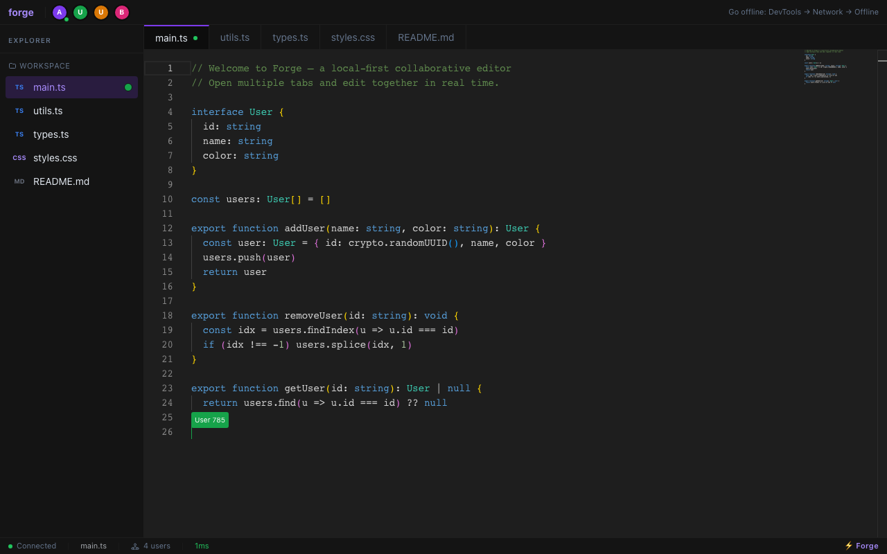
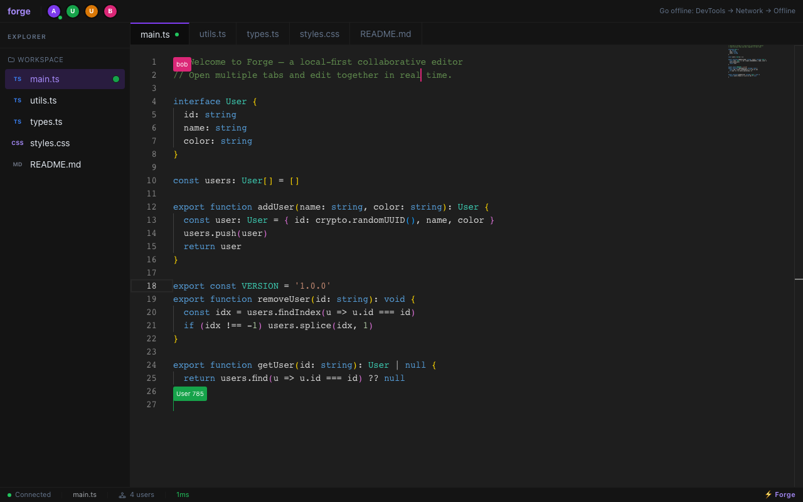
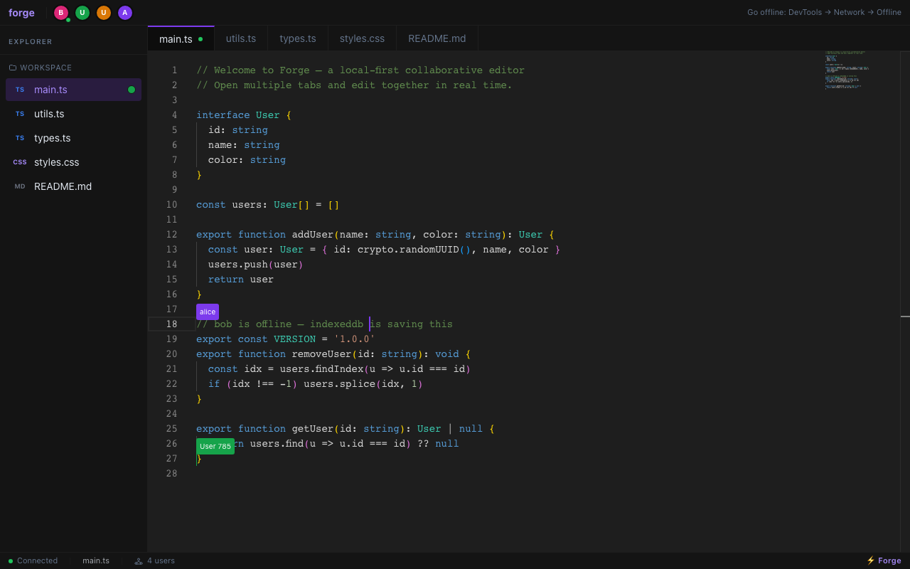
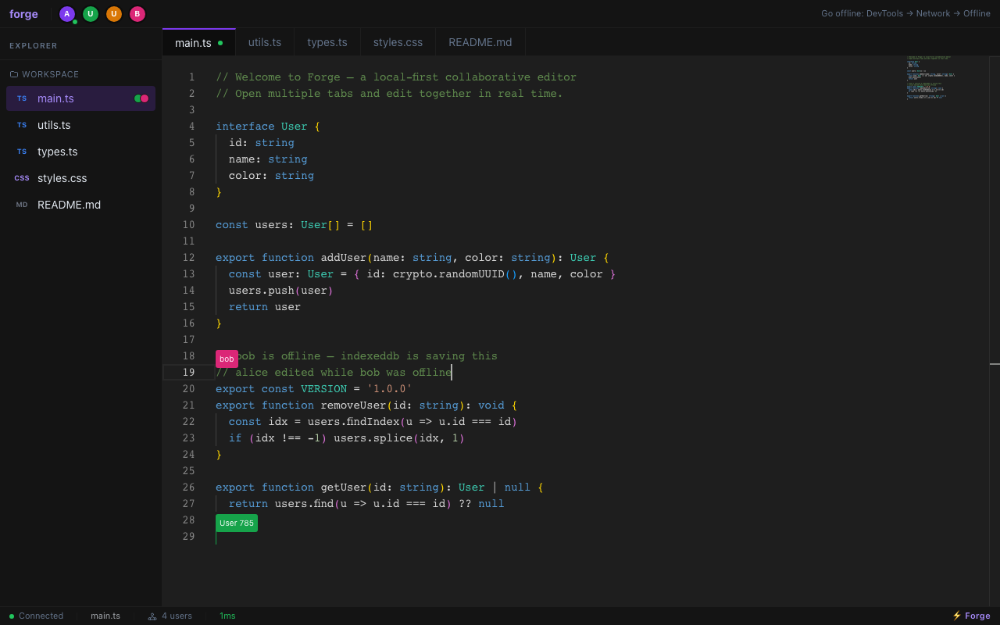

# Forge — Local-First Collaborative Code Editor

> Real-time multiplayer editing · Offline conflict resolution · Live cursors · Redis Pub/Sub scaling



## Features

- **Real-time sync** — edits appear on every connected tab instantly via Yjs CRDTs
- **Live cursors** — see where every collaborator is typing, with color-coded labels
- **Offline-first** — keep editing with no connection; IndexedDB persists everything locally
- **Conflict-free merges** — reconnect after going offline and watch both sides merge automatically
- **Multi-server scaling** — Redis Pub/Sub broadcasts updates across any number of server instances

### Live cursors — two users editing the same file simultaneously


### Offline mode — IndexedDB saves every keystroke locally


### After reconnect — CRDT merges both edits with zero data loss


## Stack

| Layer | Tech |
|---|---|
| Frontend | Next.js 14, Monaco Editor, Tailwind |
| Sync | Yjs (CRDT), custom WebSocket protocol |
| Offline | y-indexeddb (IndexedDB persistence) |
| Presence | y-protocols awareness |
| Transport | Node.js WebSocket server |
| Scaling | Redis Pub/Sub |

## Quick Start

```bash
# 1. Install
npm install

# 2. Start the WebSocket server (port 1234)
npm run server

# 3. In another terminal, start the web app (port 3000)
npm run web
```

Open http://localhost:3000 — then open a second tab to see real-time collaboration.

## With Redis (multi-server scaling)

```bash
# Start Redis
docker-compose up redis

# Or full stack
docker-compose up
```

## How to Test It Yourself

1. Open two browser windows at http://localhost:3000
2. Edit the same line in both — changes merge instantly via CRDT
3. Go offline: DevTools → Network → Offline
4. Keep editing in the offline tab
5. Edit the same lines in the online tab
6. Reconnect — Yjs merges both sides with zero data loss
7. Watch live cursors update in real time

## Architecture

```
Browser Tab A                    Browser Tab B
    │                                 │
    │  Y.Doc (Yjs CRDT)               │  Y.Doc (Yjs CRDT)
    │  y-indexeddb (offline)          │  y-indexeddb (offline)
    │                                 │
    └──────────── WebSocket ──────────┘
                      │
              Node.js WS Server
              (y-protocol sync)
                      │
               Redis Pub/Sub
               (multi-server)
```

**Conflict resolution:** Yjs uses a CRDT called YATA. Concurrent edits to the same position are merged deterministically without user intervention, preserving all intent.

**Offline:** y-indexeddb persists the full document state to IndexedDB. When reconnecting, the client sends its state vector; the server replies with only the missing updates. Zero full-document transfers.
